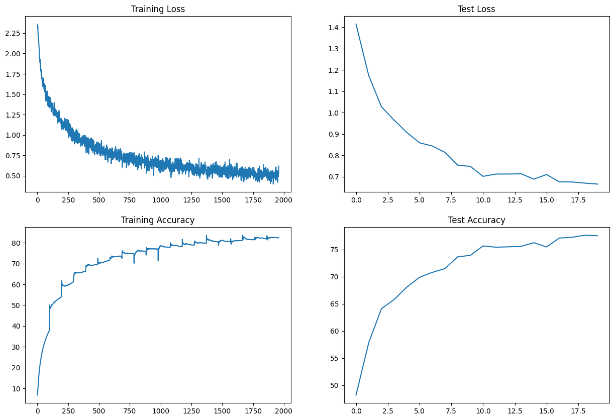
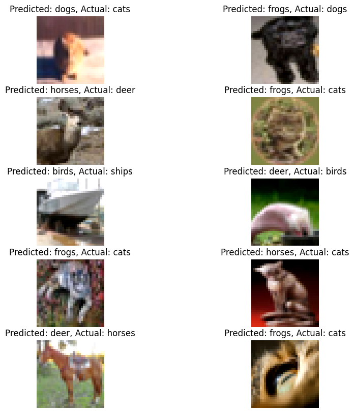
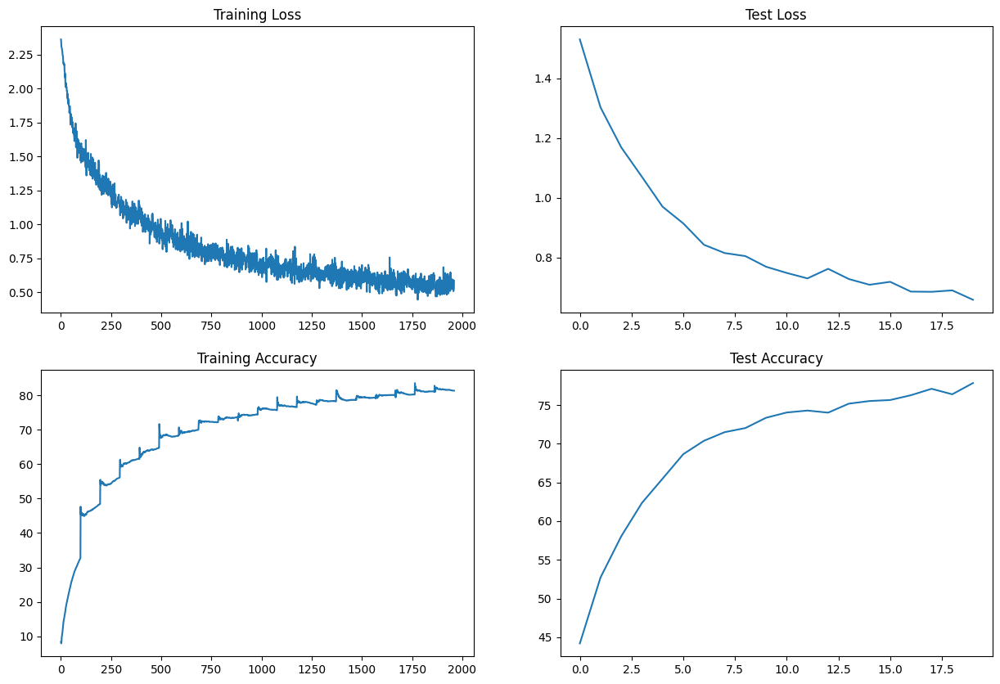
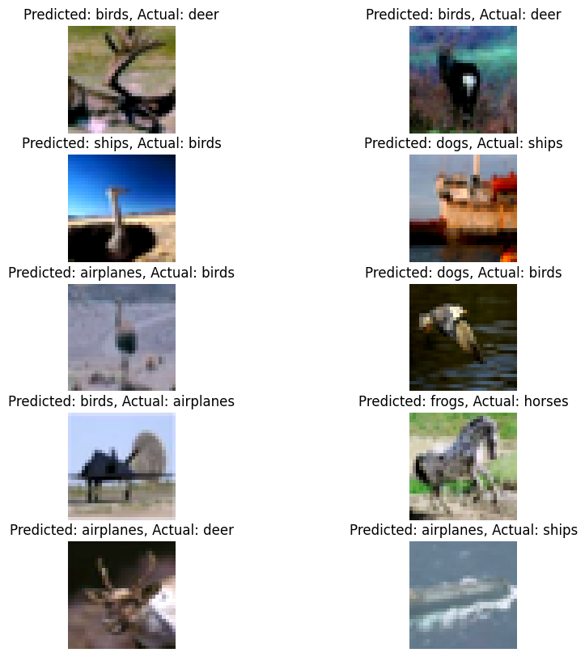
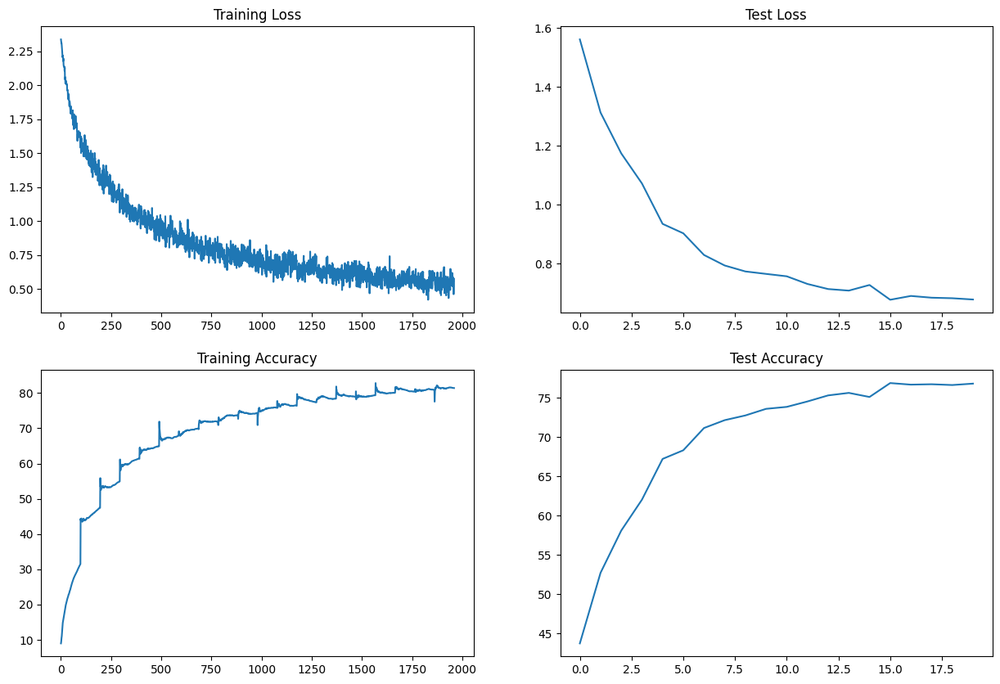
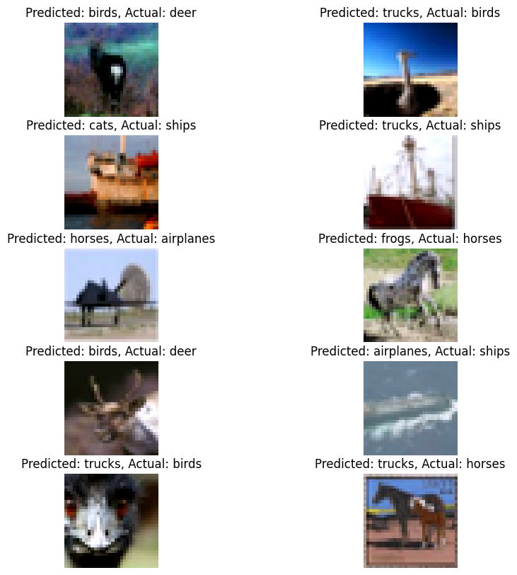

# Task 
- Make this network: C1 C2 c3 P1 C3 C4 C5 c6 P2 C7 C8 C9 GAP c10 , small c = 1x1
- Keep the parameter count less than 50000
- Try and add one layer to another
- Max Epochs is 20
- You are making 3 versions of the above code (in each case achieve above 70% accuracy):
    - Network with Group Normalization
    - Network with Layer Normalization
    - Network with Batch Normalization
- Share these details
    - Training accuracy for 3 models
    - Test accuracy for 3 models
- Find 10 misclassified images for the BN model, and show them as a 5x2 image matrix in 3 separately annotated images. 

### Batch Normalization 

- <b>Graphs</b> : 

  

- <b>MisClassified Images </b>

  

### Group Normalization 

- <b>Graphs</b> : 

  

- <b>MisClassified Images </b>

  

### Layer Normalization
- To perform LN Normalization, just use Group Nomaliation with group = 1 . 

- <b>Graphs</b> : 

  

- <b>MisClassified Images </b>

  

